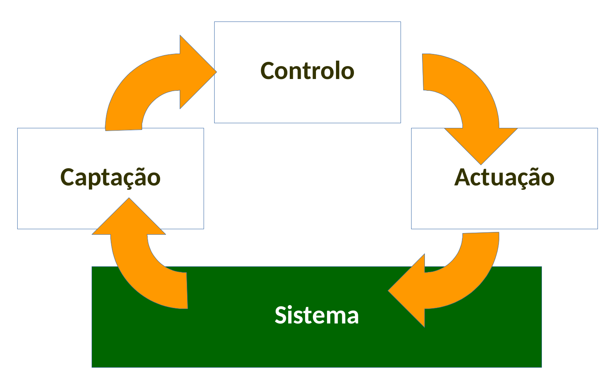

# Eletrónica 4 

Eletrónica 4 é efetivamente Sistemas de Instrumentação em Eletrónica

__TODO__ Documentos para ler com atenção:

- Guião da disciplina
- Guia dos trabalhos práticos

# Docentes
- Pedro Fonseca
	- pf@ua.pt
	- **Atendimento:** 4ª feira, 16:00 - 18:00 IT1
	- \url{http://sweet.ua.pt/pf}
- Rui Escadas
	- rmm@ua.pt
	

# Sistemas de Insturmentação em Electrónicaa

Controlo -> Atuação -> Sistema -> Captação

O diagrama representa o seguinte raciocínio:

- Existe um sistema físico que pretendo controlar
- Uso um transdutor para ir ao mundo físico obter informação e converter essa informação para um sinal elétrico que posso interpretar
- Para puder atuar de forma eficiente preciso de captar a informação relevante sobre o seu funcionamento
- Usando um algoritmo de controlo adequado, irei interpretar esse sinal e de seguida, atuar no sistema

- O objetivo de um sistema de controlo é impor um comportamento à saída de um sistema
- A questão que o projetista deve se perguntar é: "O que tenho que impor à entrada desse sistema para que a saída seja o que desejo"

	 
Os sistemas de instrumentação em eletrónica estão presentes vários ramos:

- Eletrónica de Consumo
	- smartphones
	- tv
- Medicina
	- hoje em dia é inteiramente dependente de dispositivos que utilizam instrumentação em eletrónica
- Ambiente
- Produção Industrial
- Automóveis
- Aviões
- Comboios
- Eletrodomésticos
- Dispositivos de Comunicação
- etc.

Tem se tornado cada vez mais necessários devido ao aparecimento das `Smart`

- `SmartCities`
- `SmartHomes`
- `SmartFarms`
- ...

	 
## Exemplos de sistemas

- reator químico
	- monitorização da temperatura

- carros: 
	- Sistema ABS: 
		- 	sistema físcico: carro, rodas
		- 	sensor que detete se a roda está a rolar ou não
		- 	se uma das rodas bloqueou o sistema de controlo atua sobre os travões, libertando o calço
		- 	deixa a roda girar, ganhar aderência e depois volta a travar
	- Sistema ESP
		- determinar se o carro está em risco de sair ou não da curva
	- medir os gases de escape
	- atuar de acordo com
	- carro é um central de comunicações
	- sensor de gravidade de acidente

- Smart city
	 Cidade com sensores
	 - Atua em alguns sistemas físico para:
		 - otimizar o tráfego
		 - reduzir a poluição
		 - (IEEE page for smart cities)[https://smartcities.ieee.org/]

- Smartphone
	- sensor de luz
	- gps
	- acelerómetro
	- girsoscópio

- Medicina
	> qualquer unidade e cuidadosintensivos é uma montra de eletrónica

- Controlo de processos industriais

- Indústria 4.0
	- Cada produto possui uma tag RFID única
	- em cada tag vai a recieta de produção
	- máquinas lêm as tags
	- consigo fazer **lotes de 1**
		1. fazer 1 unidade do tipo A
		2. fazer 2 unidades do tipo B
		3. fazer 1 unidade do tipo A
	- Posso fazer a mudança de produtos na linha em tempo real
	- Industrial Internet Consortium
		- sistema físico
		- captação de sinal
		- controlo
		- atuação

> Dever de diligência de um Engenheiro: Não devemos fazer única e simplesmente aquilo que nos é dito que nos devemos fazer

## Metrologia
Detalhado o diagrama de instrumentação anterior obtemos:

Controlo -> Atuação -> Sistema -> Captação de Sinal -> TRatamento/Acondicionamento -> Controlo
Tratamento/Acondicionamento -> Indicação/Registo

A metrologia involve:

- **Captação de sinal** usando `sensores`
- **Tratamento/Acondicionamento** desse sinal, usando `Circuitos de Acondicionamento`
- **Indicação/Registo** usando um microcontrolador + memória para guardar + registar os valores medidos

Qualquer medição de um sinal do mundo físico está sujeita a **ruído** na captação de sinal. O ruído é mais nefasto caso afete a malha de feedback.

# Objetivos gerais de E4
- Conhecer os conceitos básicos de metrologia 
- Conhecer dispositivos que permitem a **trandução** de outras grandezas em grandezas elétrićas
- Conhecer e saber projetar os circuitos de **aquisição**, **atuação** e **conversão de sinal**
- Conhecer e saber **eliminar/reduzir o efeito de perturbações**, como o ruído e interferências

# Aulas e Avaliação
- Teóricas [60%]: 
	- Essencialmente expositivas
	- mini testes durante o semestre
	- duas provas escritas 
		1. Durante o semestre
		2. Época de Exames
- Práticas: [40%]
	- 1 trabalho para todo o semestre
	- até 8 de Junho
	- implica **preparaçao e organiação**
	- existem 9 trabalhos propostos
	- Qualquer trabalho proposto tem de defender a 
	- Propostas têm de ser entregue até 3 feira, dia 20

$$NF = 0.6 \times CT + 0.4 \times CL $$
$$CT = 0.35 * PE1 + 0.55 \times PE2 + 0.1 \times MT$$

Abreviatura     Descrição
------------   -----------
NF				 	 Nota final
CT				 	 Componente Teórica
CL				 	 Componente Laboratorial
PE1			 	 Teste 1
PE2			 	 Teste 2
MT				 	 Mini-teste

Nota mínima em CT e CL: 8 valores

# Trabalho Prático
- Projeto simples para todo o semestre
- Projeto de um sistema simples de instrumentação e controlo
- Grupos de 2
- Componente de HW e SW
- Sistema baseado em micro-processador/micro-controlador
	- PIC32MX795, Microchip
- Interface com sensores
	- Acondicionamento de sinal
	- Sinais de baixo nível $\implies$ proteção do ruído
	- Sensores
	- Atuadores
	- Interface com o operador
- Ação sobre o mundo exterior
	- Indicação
	- Registo
	- Atuação (PWM, pontes H)
- Inserção numa malha de alimentação
	- É/Pode ser necessário utilizar algoritmos de controlo elementares

**Cuidados a ter:**

- Nunca ensaio o circuito de preparação 
- Primeiro ensaio do circuito sobre um modelo do circuito que simula o sensor que pretendo usar
- Só depois é que ligo o circuito de condicionamento

 > Quanto menos variáveis tiver de cada vez, melhor

Considerações:

- Irá existir uma sessão de esclarecimento
- Acesso às pré-montages (set-up) **só é possível durante as aulas práticas**
	- Planeamento cuidadoso do trabalho
	- Desenvolvimento de circuitos/modelos equivalentes para testar os vários sensores
- Será usada a `MPLAB X IDE` e o `X32`
- O levantamento da PIC + Programador + Cabo USB requer uma caução de 50€
- Requisição na secretaria do DETI
	- Acompanhada por **formulário** + **talão MB com NIB**

## Trabalho Autoproposto
- Sujeito a aprovação pelos docentes
- Deve ser redigida uma proposta detalhada, contendo:
	- Especificação do trabalho proposto
	- Componentes requeridos 
		- tipo de processador
		- sensores
		- outros componentes
	- Aspetos de implementação 
		- estruturas mecânicas
	- Contribuição para os objetivos de Eletrónica 4

**Prazo: FINAL DA PRIMEIRA SEMANA DE AULAS!**

- Interface com o exterior:

## Modelo de Realização do Projeto 
**3 fases**

1. Projeto
2. Montagem da infrastrutura
3. Programa da Aplicação

**A passagem a uma fase seguinte do projeto está condicionada à conclusão com sucesso da fase anterior**

**Documentação**

- papel + pdf
- **Técnica**
	- esquemas
	- diagramas de blocos
	- especificação de procedimentos de teste e validação
- Manual de Utilizador (Fase 3)
- Relatório de Execução (Fase 3)

**Apresentações**

- Avaliação laboratorial
- Apresentações públicas

### Fase I: Planeamento e Projeto
**Data de término:** 3 aula, **6 Março**

**Tema:** Planeamento do projeto

- Projeto detalhado do `hardware` a ser implmentado, através de:
	- Diagrama de blocos
	- Esquema elétrico
	- Listagem identificando os tipos de sinais e gamas de variaçãoem pontos críticos do circuito
- Planeamento do trabalho
	- Tabela de atividades
	- Interdependência entre as tarefas
	- Esforço estimado
	- Calendarização
	- Gráfico de rede (PERT)

Os documentos devem acompanhar a realização do trabalho ao longo de todo o semestre. É natural que surja a necessidade de efetuar alterações durante as fases II e III. Neste caso, **estes documentos devem ser atualizados**.

### Fase II: Implementação da Infrastrutura
**Data de término:** 9 aula (P2), **17 Abril**

**Objetivo:** Aceder a todos os dispositivos sem coordenação entre eles

**Tema:** Montagem + `device drivers`

Para isso deve ser concluída a:
	- Montagem de todos os componentes
	- Desenvolvimento/Escrita dos `device-drivers` _(hardware abstraction layers)_
	- Validação da implementação
	- A leitura da informação deve estar dentro das margens de erro definidas

No final deve ser possível aceder a todos os dispositivos de I/O sem **existir coordenação entre eles**:

- Ler dados dos sensores
- Atuar sobre os atuadores
- Enviar/Receber mensagens do/para operador

No final desta fase os grupos têm de apresentar:

- Material montado 
- `device drivers`
- Atualização da documentação entregue na fase I, se se justificar
- Especificação dos procedimentos de validação dos respetivos resultados

Existe uma aula de avaliação laboratorial:

- A validação é feita pelo docente em contexto de aula prática
- Compete a cada grupo a **definição dos procedimentos de teste** do seu sistema

### Fase III: Sistema Completo
**Data de término:** Penúltima aula, **29 Maio**

**Tema:** _Software_ de gestão e controlo

Criação do sistema final segundo as especificações iniciais/definidas sobre a infrastrutura desenvolvida na Fase II.

Deve ser apresentado:

- Sistema **desenvolvido**, a funcionar de **acordo com as especificações desenvolvidas**
- Manual do utilizador
- Atualização da documentaçãp entregu nas Fases I e II, sempre que se justifique
- Relatório de Execução, incluinod os testes de conformidade do sistema desenvolvido

Existe uma aula de avaliação laboratorial:

- A avaliação do funcionamento é feita pelo docente em contexto de aula prática
- A avaliação é efetuada até à **penúltima aula do semestre**
- A última aula é para a **apresentação dos projetos**

## Documentação
O objetivo da documentação é avaliar a conformidade com os objetivos definidos.

A documentação técnica correspondente deve ser entregue no final de cada fase.

Objetivos técnicos através da **documentação técnica descritiva do sistema**, tal como:

- Esquemas
- Diagramas de blocos
 
**Manual de utilizador** que deve explicitar o modo de utilização e as características técnicas do sistema, entre outros.

**Relatório de Execução:**

- Processo de realização
- Dimensionamento
- Opções tomadas e a sua justificação
- Rsultados obtidos
- entre outros

## Apresentações
Apresentação  Discussão  Duração
------------  ---------  -------
10 min			5 min		  15 min

Deve ser apresentada e discutida a solução desenvolvida, incluindo:

- Objetivos
- Enquadramento
- Abordagem
- Resultados
- Conclusões

## Critérios de Avaliação

- **Funcionamento:**
	- Grau de cumprimento dos objetivos
	- Robustez da solução
- **Documentação:**
	- Grau de detalhe
	- Rigor técnico
	- Clareza
	- Qualidade de escrita
- **Apresentação:**
	- Clareza da apresentação
	- Domínio dos conceitos

> Defender **o que** faze e não **como** faz

A fase I é apenas um requesito para a fase II, não é avaliada

                                                   Fase II     Fase III
------------------------------------------ 		----------   ------------
Peso Total                                         50% 			50%
Funcionamento                                      50% 			45%
	Documentação                                    50% 			25%
	Apresentação                                    --- 			15%
	Avaliação da apresentação (pela turma) 			--- 			5%
	Avaliação pelos pares (grupo) 						--- 			10%

**Podem ser feitas, ao longo do semestre, provas de avaliação individuais sobre os trabalhos práticos**

Notas superiores a 16 exigem a prestação de uma prova suplementar:

- Introdução de uma melhoria/característica adicional ao projeto

## Normas Gerais
- Todos os trabalhos pressupõem a sua preparação prévia
- É dada importância à realização progressiva dos trabalhos
- Para apoio aos grupos é necessário:
	- esquemas de circuitos eletrónicos
	- pesudo-código/fluxograma para os programas

## Logbook
Todos os **elementos relevantes** para o trabalho devem constar num livro de registos/ser nele baseados

A registar:

- Todos os cálculos
- Esquemas dos circuitos
- Documentação dos programas
- Observações feitas durante as aulas
- Tratamento posterior/análise dos dados obtidos

 
