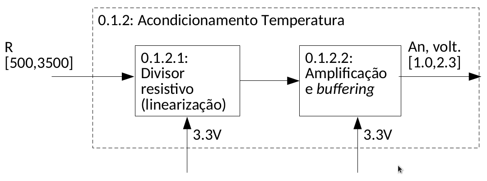

# Organização de um projeto em Engenharia

Qualquer projeto de engenharia tem como objetivo partir de um **problema** e chegar a uma **solução**.

O problema a resolver pode ser uma questão de engenharia, financeira, marketing, etc.

Podemos assim dividir o desenvolvimento do projeto em duas componentes:

- **Técnica:**
	- É a componente técnica do projeto
	- Responde à pergunta: _"Como é que eu vou resolver o meu problema?"_
	- Pretende desenvolver uma solução técnica para responder ao problema inicial
- **Organizacional:**
	- É a componente de gestão do projeto
	- Responde à pergunta: _"Como é que eu me vou organizar para gerir os meus recursos?"_
	- Pretende administrar os recursos de forma a atingir o resultado esperado

Os recursos devem ser geridos de modo a controlar:

- a qualidade do resultado
- o custo desse resultado
- o tempo que demora a concluir para obter o resultado

São considerados recursos (e portanto devem ser geridos):

- Nº de pessoas que tenho
- Orçamento
- Tempo disponível
- Infraestrutura
- Outros Recursos/Materiais
- Ferramentas

## Tipos de abordagens da componente técnica de um projeto de engenharia
 
**Bottom-up**

- Começo a analisar o projeto pelos seus detalhes (e.g., sensores) e "vou subindo" até ao conjunto global
- Começo a "construir" o projeto como a interligação de várias partes separadas cujo funcionamento interno já estudei.

	 
**Top-down**

- Começo a analisar o projeto pelo todo e depois vou especificando
- Estou mais interessado na ligação entre os diferentes módulos do que no funcionamento isolado de cada um deles
- A engenharia segue principalmente um abordagem Top-down
	- E.g.: A engenharia eletrotécnica é uma engenharia de produto, logo a principal preocupação é criar produtos de consumo
	- As primeira perguntas a que tenho de responder são: 
		- _"O que é que vou fazer com isto?"_
		- _"Quem quer este produto está à espera de quê?"_

Na prática, deve ser utilizado uma mistura de ambas as abordagens:

- Top-down sempre que possível (para ter a visão global do sistema)
- Bottom-up só necessário para garantir que o módulo funciona

## Fases de um projeto
 

Os métodos ágeis distinguem-se dos métodos em cascata porque, ao contrário dos métodos em cascata, que iteram **uma única vez sobre o diagrama de blocos**, os métodos ágeis efetuam um elevado número de iterações do diagrama de blocos, sendo capazes de antecipar os testes dos vários módulos e, consequentemente, problemas futuros.

As fases de um projeto, num planeamento waterfall consistem em:

1. Ver o que quero fazer
2. O que estão á espera que seja possível fazer
3. o que é que eu vou fazer
4. Fazer
5. Testar

O que é pura teoria, uma vez que tenho de ir testando e revendo as decisões que tomo à medida que o projeto avança

Num **Método Ágil**:

- Vou fazendo as várias partes do projeto
- Não deixo a integração e teste para o final
- Estruturo o trabalho para que possa fazer testes o mais cedo possível
- Realizo testes unitários, individualmente a cada módulo/componente, com o menor número de variáveis
- Contínuo a fazer o ciclo, repetição após repetição.

### Análise de Requisitos
> O que o sistema deve fazer?

Não definir o como. **As soluções são para depois**

Descrever quais as características pretendidas para o sistema

#### Especificação de requisitos
- **Linguagem clara** (não técnica)
	- tem de ser compreensível por qualquer pessoa
- **Completa**
	- temos de garantir que não nos contradizemos
- **Congruente/consistente**
- **Precisa** e **sem ambiguidades**
- deve ser **verificável**
	 > Vocês numa empresa devem puder ser verificáveis
	- tudo deve ser quantizável
	- deve ser possível fazer uma _checklist_ de tudo o que foi feito

### Projeto do sistema
- Dividir o sistema em grandes blocos
- Identificar **blocos funcionais**
- Definir a comunicação entre eles
	- que sinais?
	- de onde para onde?

### Projeto detalhado
- Dividir cada um dos **blocos funcionais** em **circuitos/programa funcional**
- **Testar** cada um desses blocos **separadamente**
	- Testes unitários
	- Verificação individual
- **Especificar Interfaces**
	- Quais os tipos de ligações?
		- I2C
		- Linha séria
		- Sinal analógico
		- SPI
		- etc.
	- Qual a natureza dos sinais?
	- Qual a gama de variação dos sinais?
- "Agarrar" o problema com uma versão mais simples e controlável
	- Testar versões simplificadas dos objetivos finais
	- Exemplos
		- Objetivo: Comunicação pela porta série
		- Teste elementar: Enviar um carácter pela porta série
	> Enquanto as funcionalidades base não estiverem feitas não vale a pena fazer diversões
- Identificar o fundamental (MoSCoW)

### Integração e teste
- Reunião dos vários subsistemas desenvolvidos
	- Os **subsistemas já devem estar testados antes de serem integrados**
- Ciclo em V:
	- Começo top-down
	- Depois faço top-up

- Teste final do sistema completo
	- Testar **uma variável de cada vez**
	- Adicionar **componentes um a um**
	

### Resumo
1. Decidir o **que** se quer fazer
2. Decidir **como** se faz
3. **Dividir** um problema completo e complexo em várias partes mais simples, tratáveis individualmente
4. Definir **objetivos** intercalares
5. Acrescentar uma única de cada vez
	- Cuidado com o debouncing
6. Fazer o que preciso na altura devida

 
## Exemplo: Controlo de aquário

### Bloco nível 0
- O que é que  eu quero
- Bloco com entradas e saídas do sistema
- Os requisitos do sistema são definidos a este nível

 
### Bloco nível 1
- Identifica o que vou medir (ler do sistema)
	- identificar sensores
- Onde vou atuar?
	- identificar atuadores
- Identificar placas de controlo
	- microcontrolador
- Identificar alimentação dos circuitos
- Cada interface **detalha as interfaces** do nível acima

### Bloco nível 2:
Bloco que indica a existência de:

- Sensores
	- Tipo de sensor (digital, analógico, etc.)
	- Circuitos de Acondicionamento
	- Características dos sinais
		- Tipo de sinal
		- Excursão
- Bloco de gestão de energia

Neste nível devo definir os blocos, mas **sem me preocupar** com o que seu conteúdo

### Acondicionamento de Sinal: algumas dicas práticas

- Devo tentar **linearizar** a resposta do sensor
	- Exemplos:
		- LM335: Variação linear
		- NTC: Variação não linear $\implies$ introduzir num divisor resistivo para melhorar a resposta
- Não devo usar a gama total do sinal para transmitir os dados dos sensores. Se o sensor tiver fora dos limites não tenho forma para saber se existe algum problema. Ao limitar a gama de variação do meu sinal de dados, permito a detecção de situações anómalas de forma bastante simplificada

### Bloco nível 3
É neste nível e detalhe que se deve especificar os circuitos de acondicionamento

Até os dados dos sensores serem lidos, irão passar por um conjunto de blocos, sendo necessário existir a conversão para o exterior do sensor

#### Cadeias de Instrumentação
- Cada um dos blocos implementa uma função matemática
	- função de transferência entre os sinais de entrada e saída
- É preciso conhecer estas funções de transferência. Podem depender da:
	- implementação escolhida
	- dos componentes usados _(ver datasheets)_
	- do microcontrolador

Um exemplo de duas cadeias de instrumentação, uma com um sensor linear e com correção de nível e outra com um sensor não linear e respetivo mecanismo de linearização.

Em ambas as cadeias de instrumentação os níveis intermédios do sinal não são especificados. Podem depender da solução particular implementada (a especificar no diagrama abaixo) e/ou não serem relevantes nesta altura.

Embora os dois sinais apresentados possuam a mesma gama, as suas características são muito diferentes (e.g., variações lineares vs não lineares)

Os blocos das cadeias de instrumentação também podem existir dentro do microcontrolador, i.e., estarem implementadas em _software_.

A grande vantagem da ADC do uso de ADCs são que o **sinal à entrada pode ser não linear**, desde que a relação seja  **biunívoca**:

- A cada valor de temperatura só pode corresponder uma tensão
- Se a função de transferência for biunívoca e conhecida, as não linearidades dos sensores podem ser compensadas.

- 1º Características do sensor $\implies$ datasheet sensor
- 2º e 3º Circuito de acondicionamento projetado
- 4ª ADC utilizada $\implies$ datasheet microcontrolador
- 5º Acondicionamento do sinal em SW $\implies$ algoritmo implementado. Função de transferência total da cadeia. Corrige as não linearidades

### Resumo
- **diagrama de blocos** descreve os sistema em termos de:
	- blocos
	- ligações/sinais entre blocos
- É organizado por **níveis**
- Na **cadeia de instrumentação**, cada bloco implementa uma **única função matemática**

  
## Componente Organizacional
>   ou como dividir um trabalho complexo em tarefas simples

Tem como principal objetivo garantir a gestão de recursos.

> Como lidar com a complexidade?

- **Dividir** um trabalho complexo em tarefas simples
- Verificar se todas as atividades parcelares estão identificadas
- Cada atividade tem de ter um resultado **concreto**, **bem definido** e **verificável**

Por em prática uma **Work Breakdown Structure (WBS)**

**Projeto:** conjunto de **atividades coordenadas entre si** com o objetivo de criar um produto, um serviço o qualquer outro resultado, **dentro de limites** temporais e financeiros **bem definidos**

Um projeto está sempre divido em tarefas. Uma tarefa deve responder ás seguintes perguntas:

1. O quê? $\implies$ uma atividade concreta
2. Quem? $\implies$ realizada por uma ou mais pessoas
3. Quando? $\implies$ duração determinada (possui uma data de término)

E que deve produzir um resultado concreto, definido e verificável, ou seja, que possa ser "entregue a alguém (entregável)"

### PERT - Program/Project Evaluation and Review Technique
- d efinir a sequência de realização de tarefas
	- permite a exploração das relações de dependências entre tarefas
		- as tarefas nunca são 100% independentes
		- todas as tarefas, em última instância, dependem de outra
- todas as tarefas precisam de um resultado concreto
	- O resultado concreto permite definir **precedências**
	- Se A resulta de x e B precisa de x $\implies$ A precede B
- **caminho crítico:**
	- Caminho que, tendo em conta as precedências, define a duração do projeto
	- atrasos no caminho crítico $\implies$ **atrasos no projeto!**
- Para além do caminho critico devem ser definidos **marcos/_milestones_**

> Datas concretas são motivadoras

Num diagrama de PERT, cada bloco identifica quem está responsável pela tarefa e o tempo necessário para a terminar

Em alternativa pode existir um diagrama de calendarização:

#### Diagramas PERT - Atividade no nó

#### Diagramas PERT - Atividade na seta

 
#### Estimativa do tempo necessário para concluir uma tarefa
Devo estimar o tempo necessário para cada tarefa usando 3 perspectivas

- mais provável ($t_M$)
	- calculada com base num cenário realista
	- consideramos os recursos alocados
	- a produtividade da equipa
	- interrupções
	- etc.
- pessimista ($t_P$)
	- Calculada com base no cenário de pior caso
- otimista ($t_O$)
	- Calculada com base no cenário de melhor caso

Podemos depois efetuar uma mistura das 2 ou 3 perspectivas:

- Com pesos idênticos:

$$tempo\ Estimado = t_E = \frac{t_O + t_M + t_P}{3}$$

- Ou usando a distribuição beta:

$$t_E = \frac{t_O + 4\cdot t_M + t_P}{6}$$

 
#### Representação de tarefas

#### Precedência

#### Exemplo: Escrita de um Website

Repetimos o processo anterior (para o tempo máximo) da data de término para a data de início. O intervalo de tempo entre qual as datas podem terminar e começar é o _slack time_/tempo livre

Onde não existe folga, é o **caminho crítico**. Qualquer atraso nas tarefas do caminho crítico irão provocar atrasos na data de término do  projeto.

